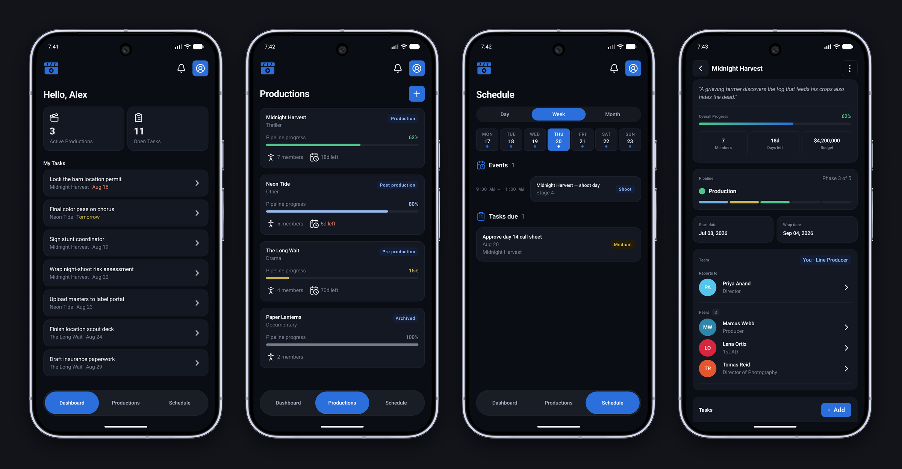

# FrameZero



Production management for film & TV crews — schedules, tasks, and the people behind them. Android, iOS, and the backend all run on one Kotlin codebase.

## Stack

Compose Multiplatform for the UI on Android and iOS, navigated with Decompose. Business logic lives in a Kotlin Multiplatform `shared` module and is partially offline-first, backed by Room and Paging 3. The server is Ktor on Postgres with JWT auth.

## Getting started

Common commands are wrapped in a [`justfile`](justfile). Install [`just`](https://github.com/casey/just)
(`brew install just`) and run `just` to list them. The raw Gradle commands below work too.

Start the backend:

```bash
docker compose up -d          # Postgres        (just db-up)
./gradlew :server:run         # Ktor on :8080   (just server)
./scripts/seed_db.sh          # demo data       (just seed)
```

Run the Android app:

```bash
./gradlew :androidApp:installProdDebug   # just android
```

For iOS, open `iosApp/iosApp.xcodeproj` in Xcode and hit Run. After changing
`shared` or `composeApp`, relink first: `./gradlew :composeApp:linkDebugFrameworkIosSimulatorArm64`
(`just ios-link`).

## Project layout

| Module | What's inside |
|--------|---------------|
| `composeApp/` | Compose UI for Android & iOS |
| `shared/` | Shared logic, models, networking, repositories |
| `server/` | Ktor backend |
| `iosApp/` | SwiftUI host |
