# Module Graph

Regenerate after changing any module dependency edge:

```bash
./gradlew createModuleGraph
```

The section below is generated by the `dev.iurysouza.modulegraph` Gradle plugin
— edit the graph by changing module dependencies, not by hand.

## Module Graph

```mermaid
%%{
  init: {
    'theme': 'neutral'
  }
}%%

graph LR
  subgraph :composeApp:features
    :composeApp:features:account["account"]
    :composeApp:features:task-create["task-create"]
    :composeApp:features:production-details["production-details"]
    :composeApp:features:chat["chat"]
    :composeApp:features:auth["auth"]
    :composeApp:features:home["home"]
    :composeApp:features:production["production"]
    :composeApp:features:task-details["task-details"]
  end
  subgraph :composeApp:shared
    :composeApp:shared:design_system["design_system"]
    :composeApp:shared:screenshot-testing["screenshot-testing"]
    :composeApp:shared:ui_text["ui_text"]
  end
  subgraph :shared
    :shared:domain["domain"]
    :shared:ui_text["ui_text"]
    :shared:test-fixtures["test-fixtures"]
    :shared:database["database"]
    :shared:dto["dto"]
  end
  subgraph :shared:features
    :shared:features:account["account"]
    :shared:features:auth["auth"]
    :shared:features:task-create["task-create"]
    :shared:features:production-details["production-details"]
    :shared:features:chat["chat"]
    :shared:features:home["home"]
    :shared:features:production["production"]
    :shared:features:task-details["task-details"]
  end
  subgraph :shared:integrations
    :shared:integrations:firebase["firebase"]
  end
  subgraph :shared:repositories
    :shared:repositories:auth["auth"]
    :shared:repositories:user["user"]
    :shared:repositories:device-token["device-token"]
    :shared:repositories:tasks["tasks"]
    :shared:repositories:dashboard["dashboard"]
    :shared:repositories:schedule["schedule"]
  end
  subgraph :shared:repositories:chat
    :shared:repositories:chat:api["api"]
    :shared:repositories:chat:impl["impl"]
  end
  subgraph :shared:repositories:productions
    :shared:repositories:productions:impl["impl"]
    :shared:repositories:productions:api["api"]
  end
  :shared:repositories:auth --> :shared:domain
  :shared:repositories:chat:api --> :shared:domain
  :composeApp:features:account --> :shared:features:account
  :composeApp:features:account --> :composeApp:shared:design_system
  :composeApp:features:account --> :composeApp:shared:screenshot-testing
  :shared:features:auth --> :shared
  :shared:features:auth --> :shared:ui_text
  :shared:features:auth --> :shared:repositories:auth
  :shared:features:auth --> :shared:repositories:user
  :shared:features:auth --> :shared:test-fixtures
  :composeApp:features:task-create --> :shared:features:task-create
  :composeApp:features:task-create --> :composeApp:shared:design_system
  :composeApp:features:task-create --> :composeApp:shared:ui_text
  :composeApp:features:task-create --> :composeApp:shared:screenshot-testing
  :composeApp:features:production-details --> :shared:features:production-details
  :composeApp:features:production-details --> :composeApp:shared:design_system
  :composeApp:features:production-details --> :composeApp:shared:ui_text
  :composeApp:features:production-details --> :composeApp:shared:screenshot-testing
  :composeApp:features:chat --> :shared:features:chat
  :composeApp:features:chat --> :composeApp:shared:design_system
  :composeApp:features:chat --> :composeApp:shared:ui_text
  :composeApp:features:chat --> :composeApp:shared:screenshot-testing
  :shared:repositories:productions:impl --> :shared:repositories:productions:api
  :shared:repositories:productions:impl --> :shared
  :shared:repositories:productions:impl --> :shared:database
  :shared:repositories:productions:impl --> :shared:test-fixtures
  :composeApp:features:auth --> :shared:features:auth
  :composeApp:features:auth --> :composeApp:shared:design_system
  :composeApp:features:auth --> :composeApp:shared:ui_text
  :composeApp:features:auth --> :composeApp:shared:screenshot-testing
  :composeApp --> :shared:repositories:device-token
  :composeApp --> :shared
  :composeApp --> :shared:database
  :composeApp --> :shared:features:account
  :composeApp --> :shared:features:auth
  :composeApp --> :shared:features:home
  :composeApp --> :shared:features:production
  :composeApp --> :shared:features:production-details
  :composeApp --> :shared:features:task-details
  :composeApp --> :shared:features:task-create
  :composeApp --> :shared:features:chat
  :composeApp --> :shared:repositories:productions:impl
  :composeApp --> :shared:repositories:chat:impl
  :composeApp --> :shared:integrations:firebase
  :composeApp --> :composeApp:features:account
  :composeApp --> :composeApp:features:auth
  :composeApp --> :composeApp:features:home
  :composeApp --> :composeApp:features:production
  :composeApp --> :composeApp:features:production-details
  :composeApp --> :composeApp:features:task-details
  :composeApp --> :composeApp:features:task-create
  :composeApp --> :composeApp:features:chat
  :composeApp --> :composeApp:shared:design_system
  :composeApp --> :shared:test-fixtures
  :shared:features:task-create --> :shared
  :shared:features:task-create --> :shared:ui_text
  :shared:features:task-create --> :shared:repositories:tasks
  :shared:features:task-create --> :shared:repositories:productions:api
  :shared:features:task-create --> :shared:test-fixtures
  :shared:repositories:dashboard --> :shared:domain
  :shared:features:production --> :shared
  :shared:features:production --> :shared:ui_text
  :shared:features:production --> :shared:repositories:productions:api
  :shared:features:production --> :shared:test-fixtures
  :shared:features:production-details --> :shared
  :shared:features:production-details --> :shared:ui_text
  :shared:features:production-details --> :shared:repositories:productions:api
  :shared:features:production-details --> :shared:repositories:tasks
  :shared:features:production-details --> :shared:test-fixtures
  :shared --> :shared:domain
  :shared --> :shared:dto
  :shared --> :shared:ui_text
  :shared --> :shared:database
  :shared:repositories:productions:api --> :shared:domain
  :shared:features:task-details --> :shared
  :shared:features:task-details --> :shared:ui_text
  :shared:features:task-details --> :shared:repositories:tasks
  :shared:features:task-details --> :shared:repositories:productions:api
  :shared:features:task-details --> :shared:repositories:chat:api
  :shared:features:task-details --> :shared:test-fixtures
  :composeApp:features:home --> :shared:features:home
  :composeApp:features:home --> :composeApp:shared:design_system
  :composeApp:features:home --> :composeApp:shared:screenshot-testing
  :shared:repositories:chat:impl --> :shared:repositories:chat:api
  :shared:repositories:chat:impl --> :shared
  :shared:repositories:chat:impl --> :shared:database
  :shared:repositories:chat:impl --> :shared:test-fixtures
  :shared:features:home --> :shared
  :shared:features:home --> :shared:repositories:user
  :shared:features:home --> :shared:repositories:dashboard
  :shared:features:home --> :shared:repositories:productions:api
  :shared:features:home --> :shared:repositories:schedule
  :shared:features:home --> :shared:test-fixtures
  :shared:test-fixtures --> :shared
  :shared:test-fixtures --> :shared:repositories:auth
  :shared:test-fixtures --> :shared:repositories:user
  :shared:test-fixtures --> :shared:repositories:dashboard
  :shared:test-fixtures --> :shared:repositories:productions:api
  :shared:test-fixtures --> :shared:repositories:schedule
  :shared:test-fixtures --> :shared:repositories:tasks
  :shared:test-fixtures --> :shared:repositories:chat:api
  :shared:integrations:firebase --> :shared
  :composeApp:shared:ui_text --> :shared:ui_text
  :shared:dto --> :shared:domain
  :shared:repositories:user --> :shared:domain
  :composeApp:shared:design_system --> :composeApp:shared:screenshot-testing
  :composeApp:features:task-details --> :shared:features:task-details
  :composeApp:features:task-details --> :composeApp:shared:design_system
  :composeApp:features:task-details --> :composeApp:shared:ui_text
  :composeApp:features:task-details --> :composeApp:shared:screenshot-testing
  :shared:repositories:tasks --> :shared:domain
  :shared:features:account --> :shared
  :shared:repositories:device-token --> :shared
  :shared:features:chat --> :shared
  :shared:features:chat --> :shared:ui_text
  :shared:features:chat --> :shared:repositories:chat:api
  :shared:features:chat --> :shared:test-fixtures
  :shared:repositories:schedule --> :shared:domain
  :composeApp:features:production --> :shared:features:production
  :composeApp:features:production --> :composeApp:shared:design_system
  :composeApp:features:production --> :composeApp:shared:ui_text
  :composeApp:features:production --> :composeApp:shared:screenshot-testing
```


